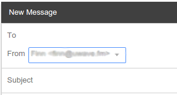

# Setting up your email through Gmail
If you want to use your email in the same inbox as your Gmail, you can simply setup a forward and
tell Gmail how to send as you.

## Setting mail forwarding
To setup mail forwarding to your Gmail, go to the [user settings](https://q.meshwith.me/postfixadmin/users/login.php),
and log in with your full email address (not just the name part). Once you're in, click
"Change your forward" at the top. Fill in your Gmail address in the To: field, select
"Forward to given email addresses only" and click the "Save Changes" button. Now all mail to your
UWave email.

## Configuring Gmail to send email from your UWave email
This is a bit trickier, but still pretty easy.

First, sign into your Gmail accound and open settings:

Click "Accounts" (sometimes "Accounts and Import") at the the top. Then click "Add another email
address you own":

It prompts you for your name and email. Fill in your name and UWave email address:

The next step, it asks for your mail server. Fill in `mail.seattlemesh.net` as the SMTP server, your
 _full email_ for username, and the password associated with your UWave email:

Click add account and close the popup. You will get an email in a few minutes, asking you to confirm
 your email, click the link:

It will give you a thank you message, you may then close the tab.

Finally, you'll want to tell Gmail to automatically set your sending address to your UWave address
when replying to an email sent to your UWave address. To do this, go back to your Gmail settings,
into the forwarding tab, find the part that says "When replying to a message" and set it to
"Reply from the same address the message was sent to".

Then hit save. Now you're all set! When you go to write an email, you'll see an option to select
the address you're sending from:

